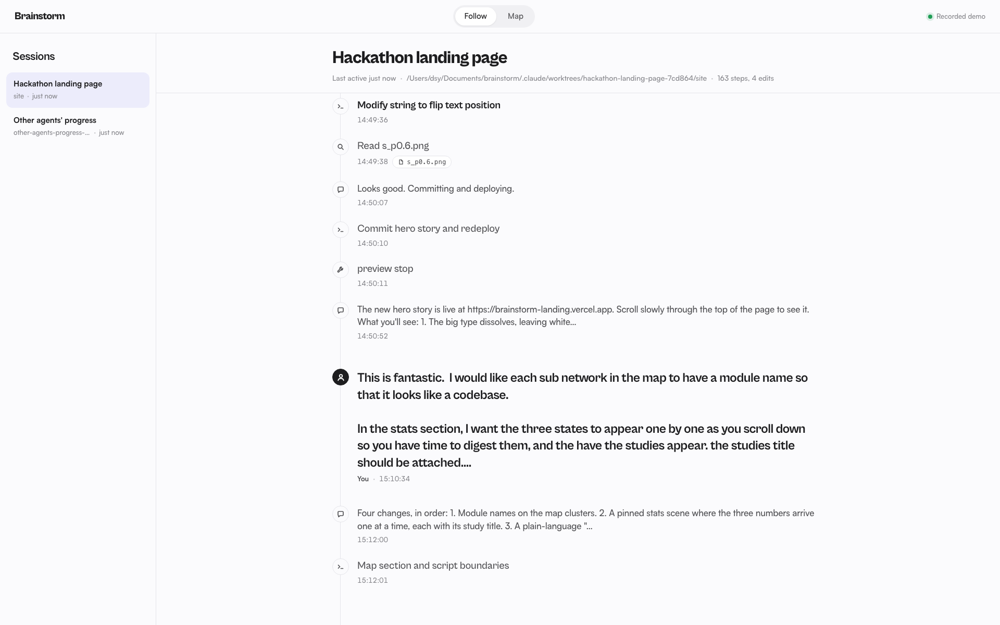

# Brainstorm

**A live map of your agents: where they go, what they touch, where they break.**

🥉 **3rd place** at [GOMYCODE × NVIDIA "Come Build with AI" 2026](https://hackathon.gomycode.com/onboarding/winners) (listed as "Brainstorm.ap"). Website: [brainstorm-landing.vercel.app](https://brainstorm-landing.vercel.app).

AI agents make it easy to stop understanding your own work. Brainstorm runs next to Claude Code and shows what the agents did, where, and why, so a human stays in the loop. Every session becomes a replay you can watch live or catch up on later, for code and for work that isn't code.

Brainstorm is a prototype (0.2). The full release is planned for late October 2026.

## Install (Claude Code plugin, preview)

In Claude Code:

```
/plugin install brainstorm --marketplace Djbrl/brainstorm
```

On Claude Code older than 2.1.275, use two commands instead:

```
/plugin marketplace add Djbrl/brainstorm
/plugin install brainstorm@brainstorm
```

Then start a new session in your project and run `/brainstorm:open`: the map opens in your browser. You need Node.js 22.13 or later. Everything runs on your machine. Settings, updates and uninstall: [plugin/README.md](plugin/README.md).

## Try the live demo

**[brainstorm-next.vercel.app](https://brainstorm-next.vercel.app)** plays back a real recording: Claude Code agents (one lead and four subagents) building Brainstorm itself. Click a thread to replay it on the map, or open Follow to read it step by step. Nothing to install.


## Run it from source

For development, or to run it without the plugin. Needs Node 24, Claude Code and git. Nemotron and a Claude key are optional (without them: plain labels, no summaries, no Ask).

```bash
git clone https://github.com/Djbrl/brainstorm.git && cd brainstorm
cp app/.env.example app/.env   # set MAP_ROOT, SESSION_FILTER, ANTHROPIC_API_KEY, NEMOTRON_*
(cd app/server && npm install) && (cd app/web && npm install)
cd app/server && npm run dev    # terminal 1: http://localhost:4000
cd app/web && npm run dev       # terminal 2, from the repo root: http://localhost:5173
```

Full guide, Brev setup and troubleshooting: [docs/run-locally.md](docs/run-locally.md). To build the plugin bundle yourself: `node app/scripts/build-plugin.mjs` from the repo root (details in [plugin/README.md](plugin/README.md)).

## What it does

- **Follow**: a live timeline of a Claude Code session: prompts, messages, tool calls and edits, each with a short label. Click a step to see its diff and ask "why?".
- **Map**: the project's modules and files as a graph. Files glow by how recently they changed. Each agent is a marker that moves to the file it writes, with a trail, and reads show as short lines of sight. Replay any thread on the map, step by step. Hover or select a file to see what it imports and what uses it; click it for its summary, the steps that touched it, and a question box.
- **Track**: the same thread as a story, top to bottom. Each stop is a place the agent worked (a file, a website, a command-line tool, a service), with a window that shows the screenshot, the file it made, the code it wrote or the command explained in plain words. It works for work that isn't code, like cutting a video with FFmpeg.
- **Errors**: a failed tool call turns the agent's marker red with one red ring, and shows red in Follow (with the first line of the error), on the replay bar and in the Track. (At the hackathon, a separate Failures view grouped and ranked them.)
- **Ask**: questions go to Claude with a small, grounded context (the step, its diff, the steps before it, the file and module summaries, at most 150 lines of the file). Every answer shows its model, tokens and cost.



## AI models

- **Nemotron 3 Nano on NVIDIA Brev** (vLLM, one L40S) does the bulk work: a two-sentence summary of every file and module, and a label of at most 8 words for every agent step. See [docs/brev-setup.md](docs/brev-setup.md).
- **Claude** answers questions, about $0.03 each. If Claude is unreachable, Nemotron answers instead.
- Most features need no AI at all: the timeline, the graph, imports, git history and recency.

Measured numbers: [docs/numbers.md](docs/numbers.md). Nemotron stress test: 81k lines of Hono summarized in 73 seconds for $0.02 of GPU time.

That was the hackathon setup. The Brev instance is shut down now, so the plugin ships with summaries off; they'll move to the Claude Code you already have (see the [roadmap](docs/roadmap.md)).

## Privacy

Local-first. Session logs are read from `~/.claude/projects` on your machine and stored in a local SQLite file. API keys, tokens and passwords are masked before anything is stored or sent. Only small, masked context packages go to a model.

## Documentation

| | |
| --- | --- |
| [Technical documentation](docs/technical.md) | Architecture, modules, contract, API, storage, how each model is used, Failures algorithm, privacy |
| [Run it on your machine](docs/run-locally.md) | Running from source, configuring, Nemotron on Brev, troubleshooting |
| [How we built it](docs/how-we-built-it.md) | One human and several AI agents in parallel: who did what, timeline, problems and fixes |
| [Roadmap](docs/roadmap.md) | Product vision, packaging as a plugin, pricing ideas, decisions |
| [Tasks and the Track](docs/tasks.md) | Following agents beyond code: how the Track is built, privacy |
| [Plugin](plugin/README.md) | Install, updates, settings, what it stores, uninstall |
| [What's next](docs/next-steps.md) | What we cut at the hackathon and how we'd build it, with size estimates |
| [Measured numbers](docs/numbers.md) · [Brev setup log](docs/brev-setup.md) · [Build log](docs/build-log.md) | The raw record |

## The hackathon

Brainstorm was built in about three hours on 27 September 2026 at GOMYCODE × NVIDIA "Come Build with AI", by one human and several AI agents working in parallel ([how we built it](docs/how-we-built-it.md)). The repo exactly as it stood at the 16:30 deadline is tagged [`hackathon-submission`](https://github.com/Djbrl/brainstorm/tree/hackathon-submission); everything after it is labeled `[post-deadline]` in the history.

## Known limits

Claude Code only today (Codex is next). No file summaries or model-written step labels in the plugin yet. The history slider, pause/steer and sharing are not built yet; see the [roadmap](docs/roadmap.md).

## License

[Functional Source License 1.1, Apache 2.0 future license](LICENSE.md) (`FSL-1.1-ALv2`). You can use, read, change and self-host Brainstorm, including at work. You can't offer it, or something built from it, as a competing product or service. Two years after each release, that release is also available under the Apache License 2.0.
