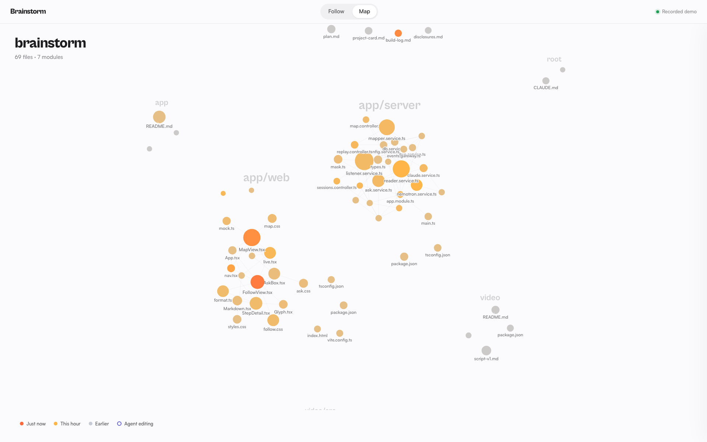

# Brainstorm

> **Note for the jury**
>
> **The hackathon entry is this `main` branch and the demo at [brainstorm-demo-black.vercel.app](https://brainstorm-demo-black.vercel.app).** The repo exactly as it stood at the 16:30 deadline is tagged [`hackathon-submission`](https://github.com/Djbrl/brainstorm/tree/hackathon-submission). The few commits on `main` after that are cosmetic (a welcome tour on the demo, links, this note) and are labeled `[post-deadline]`.
>
> A few hours after the cutoff, we also added a handful of quality-of-life features that didn't make it in time. They are **not part of the entry**. This isn't days of extra development, just an evening of small additions that give a better idea of where Brainstorm is going:
>
> - **Setup screen**: pick a workspace from your recent Claude Code projects, then watch Brainstorm read the code, map the imports, connect to Claude Code and check the models.
> - **Live agents on the map**: each agent is a marker on the file it's working on, gliding from file to file with a fading trail.
> - **Agent tracker**: every agent's route, file by file; click one to follow it with the camera.
>
> Preview: [brainstorm-next.vercel.app](https://brainstorm-next.vercel.app) (played back from a real recording) · Code: the [`post-deadline`](https://github.com/Djbrl/brainstorm/tree/post-deadline) branch.

**A live map of your code and of the AI agents writing it.**

AI coding agents make it easy to stop understanding your own code. Brainstorm runs next to Claude Code and shows what the agents did, where, and why, so a human stays in the loop.

**Try the recorded demo:** https://brainstorm-demo-black.vercel.app (Brainstorm following its own build: one lead agent and four subagents, plus the landing page session) · **Landing page:** https://brainstorm-landing.vercel.app

**New, post-deadline: install it as a Claude Code plugin (preview).** In Claude Code, run `/plugin marketplace add Djbrl/brainstorm@post-deadline`, then `/plugin install brainstorm@brainstorm`, then `/brainstorm:open`. Details: [plugin/README.md](plugin/README.md).



## What it does

- **Follow**: a live timeline of a Claude Code session: prompts, messages, tool calls and edits, each with a short label. Click a step to see its diff and ask "why?".
- **Map**: the project's modules and files as a graph, with imports as lines. Files glow by how recently they changed and pulse where an agent is editing right now. Click a file for its summary, the steps that touched it, and a question box.
- **Failures**: failing tool calls across agent sessions, grouped by cause and ranked by how often and how recently they happen, with the evidence one click away. Nemotron names each group and suggests a fix.
- **Ask**: questions go to Claude with a small, grounded context (the step, its diff, the steps before it, the file and module summaries, at most 150 lines of the file). Every answer shows its model, tokens and cost.


## The right model for each job

- **Nemotron 3 Nano on NVIDIA Brev** (vLLM, one L40S) does the bulk work: a two-sentence summary of every file and module, and a label of at most 8 words for every agent step. See [docs/brev-setup.md](docs/brev-setup.md).
- **Claude** answers questions, about $0.03 each. If Claude is unreachable, Nemotron answers instead.
- Most features need no AI at all: the timeline, the graph, imports, git history and recency.

Measured numbers: [docs/numbers.md](docs/numbers.md). Nemotron stress test: 81k lines of Hono summarized in 73 seconds for $0.02 of GPU time.

## Privacy

Local-first. Session logs are read from `~/.claude/projects` on your machine and stored in a local SQLite file. API keys, tokens and passwords are masked before anything is stored or sent. Only small, masked context packages go to a model.

## Run it

Needs Node 24, Claude Code and git. Nemotron and a Claude key are optional (without them: plain labels, no summaries, no Ask).

```bash
git clone https://github.com/Djbrl/brainstorm.git && cd brainstorm
cp app/.env.example app/.env   # set MAP_ROOT, SESSION_FILTER, ANTHROPIC_API_KEY, NEMOTRON_*
(cd app/server && npm install) && (cd app/web && npm install)
cd app/server && npm run dev    # terminal 1: http://localhost:4000
cd app/web && npm run dev       # terminal 2, from the repo root: http://localhost:5173
```

Full guide, Brev setup and troubleshooting: [docs/run-locally.md](docs/run-locally.md).

## Documentation

| | |
| --- | --- |
| [Technical documentation](docs/technical.md) | Architecture, modules, contract, API, storage, how each model is used, Failures algorithm, privacy |
| [Run it on your machine](docs/run-locally.md) | The demo, installing, configuring, Nemotron on Brev, troubleshooting |
| [How we built it](docs/how-we-built-it.md) | One human and several AI agents in parallel: who did what, timeline, problems and fixes |
| [What's next](docs/next-steps.md) | What we cut and how we'd build it, with size estimates |
| [Measured numbers](docs/numbers.md) · [Brev setup log](docs/brev-setup.md) · [Build log](docs/build-log.md) | The raw record |

## Known limits

Claude Code only today (Codex is next). The history slider, pause/steer and Markdown export are not built yet; see [What's next](docs/next-steps.md).
